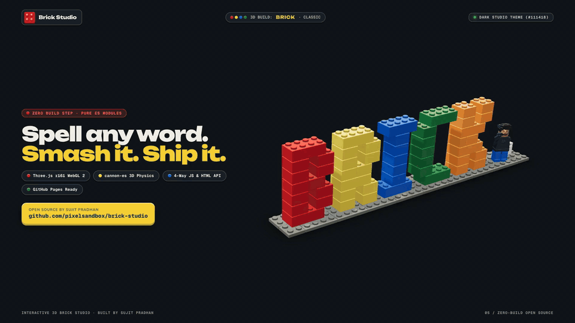

# Interactive 3D Brick Studio (`brick-studio`)

<p align="center">
  <a href="assets/img/demo.mp4" title="Click to watch full 1080p launch video with sound">
    
  </a>
</p>

<p align="center">
  <a href="https://pixelsandbox.github.io/brick-studio/"><strong>🧱 Try Live Interactive 3D Studio</strong></a>
  &nbsp;·&nbsp;
  <a href="assets/img/demo.mp4"><strong>🔊 Watch Full 1080p Launch Video (with Sound)</strong></a>
</p>

An open-source, interactive **3D Toy-Brick Playground & Header Component** built with vanilla HTML, CSS, ES modules, **Three.js r161** (WebGL 2), and **cannon-es** (3D rigid-body physics).

Spell **any custom word** (`SUJIT`, `HELLO`, `DESIGN`, `CREATE`, `PIXEL`, `MAKER`, etc.) in 3D interlocking bricks on a dynamic stud baseplate — complete with **360° turntable rotation**, **structural gravity collapse**, **force-based brick throw & screen-edge ricochet**, auto-reassembly, an interactive 3D minifigure companion, WebAudio procedural brick clicks, and a built-in **Set Word & Color Palette** modal.

Built by **[Sujit Pradhan](https://www.sujitpradhan.com)** · Product Designer at Google ([LinkedIn](https://www.linkedin.com/in/sujitkumarpradhan/) · [Instagram](https://www.instagram.com/sujit.pradhan23/)).

---

## ✨ Features

- **Dynamic 3D Brick Word Builder**: Spell any 1–10 character word (`A–Z`, `0–9`, `!`, `?`, `-`, `.`, `&`, `+`, space) in procedural 3D bricks. The baseplate and minifigure automatically scale to fit your word.
- **Full Tactile Physics & Structural Gravity (`cannon-es`)**:
  - **Hover** over bricks for spring-loaded lift and custom `Poke` stud cursor.
  - **Click** any brick to knock it loose with realistic 3D rigid-body collisions.
  - **Drag, Throw & Screen-Canvas Ricochet**: Fling any brick across the viewport (`Grab` -> `Throw`) — bricks bounce off the screen edges based on your throw force and never get lost off-screen.
  - **Structural Gravity Law**: Knocking or pulling out a bottom supporting brick causes any unsupported upper sections to immediately collapse downward under gravity.
  - **360° Drag Rotation**: Drag on the baseplate or empty stage to smoothly spin and tilt the entire 3D brick build 360°.
  - **Auto-Return**: Loose bricks automatically snap back to their home coordinates after a brief idle period.
- **Interactive 3D Minifigure**: Tracks your cursor, waves, jumps, and cycles facial expressions on click or via the `Wave` button.
- **Zero Build Step (GitHub Pages Ready)**: Pure ES modules with vendored `three.js` and `cannon-es` at the repository root — works out of the box on GitHub Pages or any static server.

---

## 📁 Directory Structure

```text
brick-studio/
├── index.html                    # Main entry (Topbar, Hero section, Customizer Modal, Footer)
├── .nojekyll                     # Ensures GitHub Pages serves all static files directly
├── README.md
├── assets/
│   ├── favicon.svg               # Red 2x2 brick icon (plain studs)
│   ├── fonts/                    # Self-hosted variable fonts (Unbounded, Nunito, Geist Mono)
│   └── img/                      # README demo video (demo.mp4, demo-preview.gif) & OpenGraph assets
├── css/
│   ├── tokens.css                # Light (#f4f1ea) & Dark (#111418) theme tokens + brick palette
│   ├── main.css                  # Header, Hero, Stage toolbar, Customizer Modal & Footer layout
│   └── components/               # Modular UI styles (buttons, cursor, flipboard, tooltip)
├── js/
│   ├── config.js                 # Single-file configuration (HERO_CONFIG + WORD_PRESETS)
│   ├── main.js                   # Entry point, Customizer Modal & window.LegoHero public API
│   ├── core/                     # raf, store, sound (WebAudio procedural clicks), utils
│   ├── ui/                       # cursor, flipboard, press, tooltip
│   └── webgl/                    # stage, models, minifig, bricks, physics, post
└── vendor/
    ├── three/                    # Vendored three.js r161 + RoomEnvironment (MIT)
    └── cannon/                   # Vendored cannon-es 0.20.0 (MIT)
```

---

## 🚀 Quick Start (Local & GitHub Pages)

### Run Locally
Serve the repository root over HTTP on `127.0.0.1`:

```bash
python3 -m http.server 8091 --bind 127.0.0.1
```

Then open `http://127.0.0.1:8091/` in your browser.

### Deploy on GitHub Pages
1. Push or fork this repository to GitHub.
2. Go to **Settings → Pages**.
3. Under **Build and deployment**, select **Deploy from a branch**, choose your `main` branch and **`/ (root)`**, and click **Save**.
4. Your interactive 3D Brick Studio will be live at `https://<your-username>.github.io/<repo-name>/`.

---

## 🧩 4 Ways to Customize the 3D Brick Word

### 1. Interactive Modal (No Code)
Click **Set Word** in the hero controls (or press `C` on your keyboard) to:
- Type any word up to 10 characters and click **Snap Bricks**.
- Choose from 6 brick color palettes (`Classic`, `Bauhaus`, `Cyber`, `Warm`, `Ocean`, `Mono`).

### 2. Edit `js/config.js`
Update `HERO_CONFIG` in [`js/config.js`](js/config.js):

```js
export const HERO_CONFIG = {
  brickWord: 'SUJIT',           // 1–10 characters built in 3D bricks
  brickPalette: 'classic',      // 'classic' | 'bauhaus' | 'cyber' | 'warm' | 'ocean' | 'mono'
  showMinifig: true,            // Toggle the 3D minifigure companion
  greeting: 'Interactive 3D',
  name: 'Brick Studio.',
};
```

### 3. HTML `data-*` Attributes on `.hero`
Set attributes directly on the `<section class="hero">` element in [`index.html`](index.html):

```html
<section
  class="hero"
  id="top"
  data-brick-word="SUJIT"
  data-brick-palette="classic"
  data-minifig="true"
>
```

### 4. URL Query Parameters or JS API
- **URL Query Params**:
  ```text
  https://<your-username>.github.io/<repo-name>/?word=ALEX&palette=bauhaus
  ```
- **Runtime JavaScript API (`window.LegoHero`)**:
  ```js
  // Rebuild the 3D bricks with a new word and palette
  window.LegoHero.setWord('MAKER', { palette: 'cyber', showMinifig: true });

  // Replay the sky drop-in assembly animation
  window.LegoHero.rebuild();

  // Explode all bricks with 3D rigid-body physics
  window.LegoHero.smash();

  // Make the 3D minifigure wave & jump
  window.LegoHero.wave();

  // Open the Set Word modal programmatically
  window.LegoHero.openCustomizer();
  ```

---

## ⌨️ Keyboard Shortcuts

| Key | Action |
| --- | --- |
| `R` | Replay the brick drop-in build animation & reset rotation |
| `Space` | Smash / explode all bricks with 3D physics |
| `W` | Make the 3D minifigure wave and jump |
| `C` | Open the **Set Word** customizer modal |

---

## ⚖️ Trademark & Third-Party Notices

- **Trademark Disclaimer:** LEGO® is a trademark of the LEGO Group of companies which does not sponsor, authorize, or endorse this project. All 3D brick geometries, minifigure parts, and procedural textures in this repository are original custom creations with plain unbranded studs.
- **Libraries & Fonts:**
  - `three.js` r161 — MIT License (`vendor/three/`)
  - `cannon-es` 0.20.0 — MIT License (`vendor/cannon/LICENSE`)
  - `Unbounded`, `Nunito`, `Geist Mono` — SIL Open Font License 1.1 (`assets/fonts/OFL.txt`)
